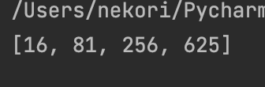

# Python. Лабораторная работа №5

# Условие задач: Генератор, применяющий заданную функцию к каждому элементу последовательности N раз. Верните только те элементы, которые изменились значительно (зависит от N и типа данных).
## Описание проделанной работы: Созданы функции: apply_function_n_times для многократного применения функции к значению и significant_change_generator для фильтрации элементов последовательности, изменившихся на величину больше заданного порога.
## Скриншоты результатов:

## Ссылки на используемые материалы:
[Документация Python](https://www.python.org/doc/)
